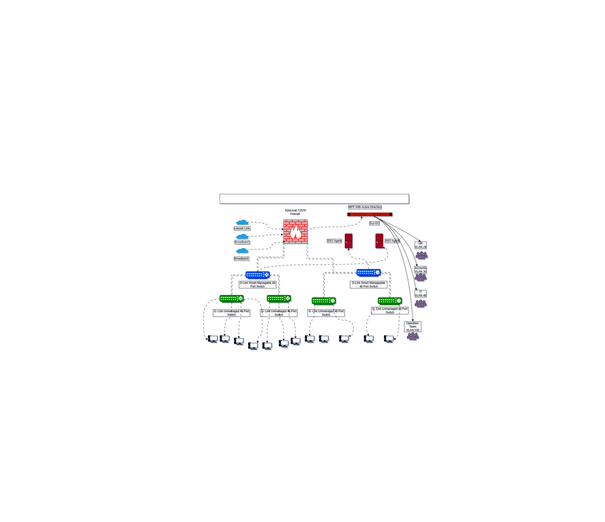

# Corporate Network Infrastructure
**Designed & Documented by Aaditya Padiya — System Admin**

## Overview
This project documents a professional enterprise-grade network for a 350-employee organization featuring:
- **Firewall:** SonicWALL TZ540
- **Core Switch:** D-Link L3 Smart Switch
- **Server:** HP Gen10 (DMZ Zone)
- **Access:** 8 VLAN-based managed switches
- **Users:** 350 systems, segmented per VLAN

## Diagram

## Features
- Dual ISP redundancy with SonicWALL load balancing
- VLAN-based segmentation and LACP uplinks
- DMZ isolation for public-facing server
- DHCP, NAT, and inter-VLAN routing
- Monitoring via SNMP & Syslog

---

## VLAN & IP Scheme

| VLAN ID | Subnet | Description |
|----------|---------|-------------|
| 10 | 192.168.10.0/24 | Users VLAN-1 |
| 11 | 192.168.11.0/24 | Users VLAN-2 |
| 12 | 192.168.12.0/24 | Users VLAN-3 |
| 13 | 192.168.13.0/24 | Users VLAN-4 |
| 14 | 192.168.14.0/24 | Users VLAN-5 |
| 15 | 192.168.15.0/24 | Users VLAN-6 |
| 16 | 192.168.16.0/24 | Users VLAN-7 |
| 17 | 192.168.17.0/24 | Users VLAN-8 |
| 50 | 10.0.0.0/24 | DMZ Server VLAN |
| 100 | 192.168.100.0/24 | Management VLAN |
| 200 | 192.168.200.0/24 | Guest VLAN |

---
